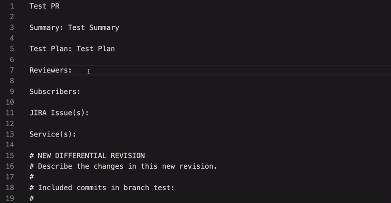
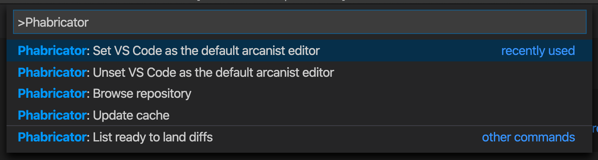

# Phabribator Extension for VSCode

[](https://marketplace.visualstudio.com/items?itemName=christianvuerings.vscode-phabricator)
[](https://marketplace.visualstudio.com/items?itemName=christianvuerings.vscode-phabricator)
[](https://github.com/christianvuerings/vscode-phabricator/actions?query=workflow%3ACI+branch%3Amaster)

## Features

- 💬 **Autocomplete** users and projects
- 🗒️ **List accepted diffs** with build status
- 🔔 **Notify** about ready to land diffs



## Install

Install options for `vscode-phabricator`:

- [Download from the marketplace](https://marketplace.visualstudio.com/items?itemName=christianvuerings.vscode-phabricator)
- Install from the command line: `code --install-extension christianvuerings.vscode-phabricator`
- Search for `Phabricator` in the VS Code extensions panel

## Prerequisites

### Set Arcanist editor to VS Code

Run the `Phabricator: Set Arcanist editor to VS Code` command:



Or run the following on the command line:

```
arc set-config editor "code --wait"
```

## Configure

- `phabricator.apiToken` **(\*)**: Generate your phabricator API token: https://phabricator.example.com/settings/user/USERNAME/page/apitokens/
- `phabricator.baseUrl` **(\*)**: Base URL for the phabricator repo: https://phabricator.example.com/
- `phabricator.diffNotifications`: Show notifications when diffs get accepted
- `phabricator.enableTelemetry`: Enable usage data and errors tracking (Google Analytics)

**(\*)** By default the extension uses `~/.arcrc` to read in these settings. Only override them when the extension doesn't work.

## Publish

Publish a new version:

1. Update `CHANGELOG.md` and add a new version
2. Publish with `vsce`

```
npm i -g vsce
vsce publish patch
```

## Acknowledgements

- Heavily inspired by [@jparise](https://github.com/jparise)'s [vim-phabricator](https://github.com/jparise/vim-phabricator) plugin.
