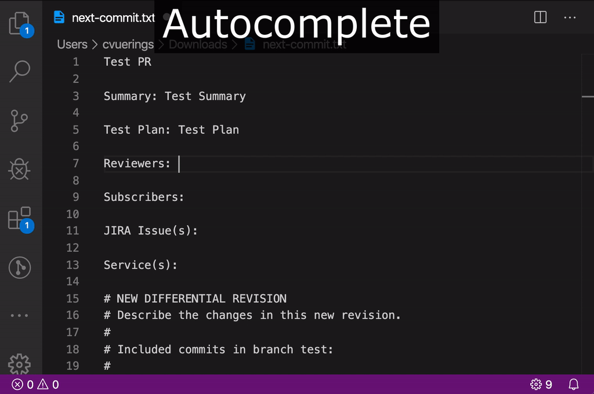
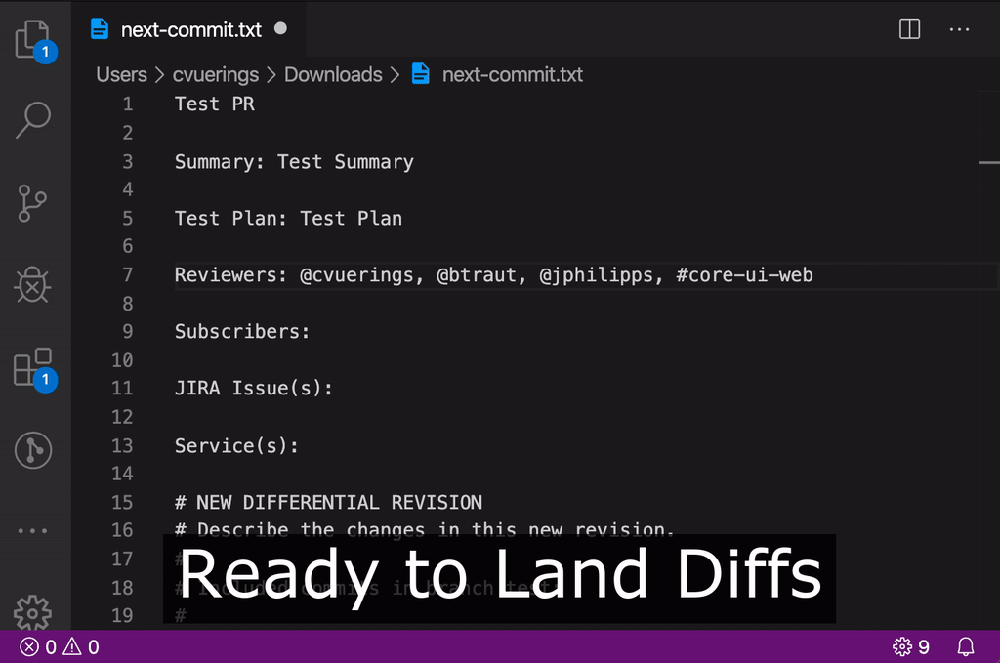

# Phabribator Extension for VSCode

[](https://marketplace.visualstudio.com/items?itemName=christianvuerings.vscode-phabricator) [](https://marketplace.visualstudio.com/items?itemName=christianvuerings.vscode-phabricator)

## Features

### Autocomplete: Users and Projects

  

### List: Ready to Land Diffs

  

### Notify: Ready to Land Diffs

  

## Installation

- Search for "Phabricator" in the VS Code extensions panel or [download on the marketplace](https://marketplace.visualstudio.com/items?itemName=christianvuerings.vscode-phabricator).

## Configuration

- `phabricator.apiToken` **(\*)**: Generate your phabricator API token: https://phabricator.example.com/settings/user/USERNAME/page/apitokens/
- `phabricator.baseUrl` **(\*)**: Base URL for the phabricator repo: https://phabricator.example.com/
- `phabricator.diffNotifications`: Show notifications when diffs get accepted
- `phabricator.enableTelemetry`: Enable usage data and errors tracking (Google Analytics)

**(\*)** By default the extension uses `~/.arcrc` to read in these settings. Only override them when the extension doesn't work.

## Publish

Publish a new version:

1. Update `CHANGELOG.md` and add a new version
2. Publish with `vsce`

```
npm i -g vsce
vsce publish patch
```

## Acknowledgements

- Heavily inspired by [@jparise](https://github.com/jparise)'s [vim-phabricator](https://github.com/jparise/vim-phabricator) plugin.
